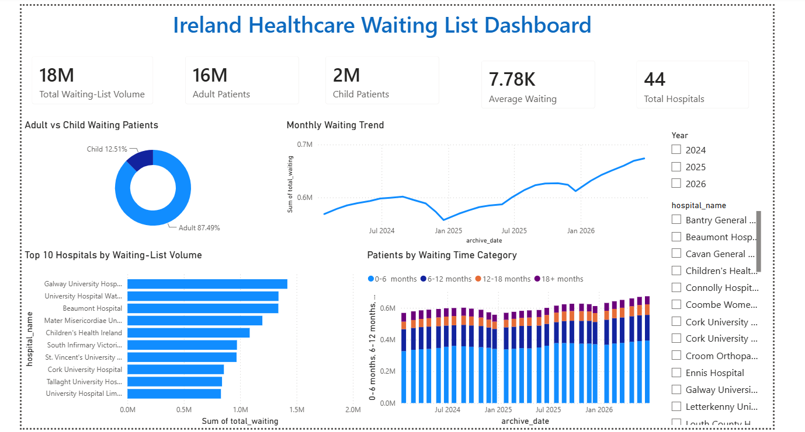

# Ireland Healthcare Waiting List Dashboard

## Project Overview

This project presents an interactive Power BI dashboard analysing Ireland healthcare waiting-list data.

The dashboard provides an overview of waiting patients across hospitals and explores patient demographics, waiting-time categories, hospital-level waiting volumes, and changes in waiting-list volumes over time.

## Dashboard Objectives

The dashboard was designed to answer the following questions:

- What is the overall waiting-list volume represented in the data?
- How does the waiting list compare between adult and child patients?
- How does the waiting-list volume change over time?
- Which hospitals have the highest waiting-list volumes?
- How are patients distributed across different waiting-time categories?
- How do the results change when filtering by year or hospital?

## Key Insights

The dashboard highlights several important patterns in the healthcare waiting-list data:

- Adult patients account for the majority of the waiting-list volume.
- Waiting-list volumes vary over time, with noticeable changes across the period analysed.
- A relatively small number of hospitals account for the highest waiting-list volumes.
- Patients waiting 0–6 months represent the largest waiting-time category.
- Interactive filters allow users to compare waiting-list patterns across different years and hospitals.

## Dashboard Features

The dashboard includes:

- Total Waiting-List Volume KPI
- Adult Patients KPI
- Child Patients KPI
- Average Waiting KPI
- Total Hospitals KPI
- Adult vs Child Waiting Patients donut chart
- Monthly Waiting Trend line chart
- Top 10 Hospitals by Waiting-List Volume bar chart
- Patients by Waiting Time Category stacked column chart
- Year filter
- Hospital filter

## Data & Methodology

The project uses healthcare waiting-list data containing information on hospitals, waiting-list volumes, patient demographics, waiting-time categories, and reporting dates.

The data was analysed and transformed in Power BI to create measures, identify trends, compare hospitals, and present waiting-list patterns through interactive visualisations.

The dashboard uses year and hospital filters to allow users to explore the data at different levels of detail.

## Tools & Technologies

- Power BI
- Power Query
- DAX
- Data Visualisation
- Interactive Dashboard Design
- Data Analysis

## Project Files

- `Ireland_Healthcare_Waiting_List_Dashboard.pbix` — Power BI dashboard file
- `Dashboard-Preview.png` — Dashboard preview image
- `README.md` — Project documentation

## Project Outcome

This project demonstrates the use of Power BI to transform healthcare waiting-list data into an interactive dashboard for analysing waiting-list volumes and trends.

The dashboard enables users to explore waiting-list volumes, compare hospitals, analyse patient demographics, examine waiting-time categories, and identify changes over time through interactive visualisations and filters.
