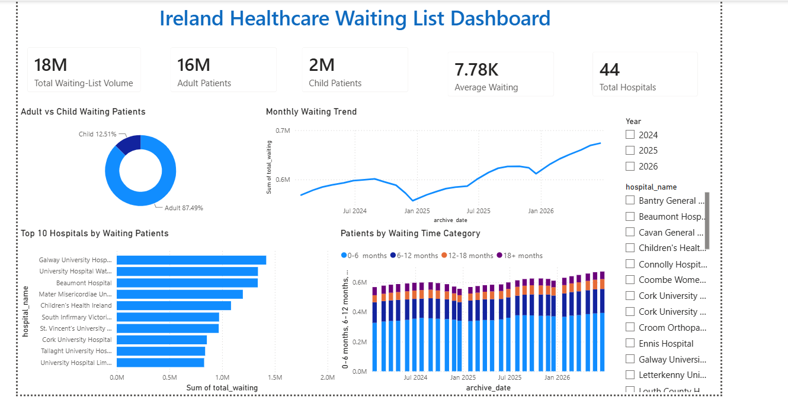

# Ireland Healthcare Waiting List Dashboard

## Project Overview

This project presents an interactive Power BI dashboard analysing Ireland healthcare waiting-list data.

The dashboard provides an overview of waiting patients across hospitals and explores patient demographics, waiting-time categories, hospital-level waiting volumes, and changes in waiting-list volumes over time.

## Dashboard Objectives

The dashboard was designed to answer the following questions:

- How many patients are currently represented in the waiting-list data?
- How does the waiting list compare between adult and child patients?
- How does the waiting-list volume change over time?
- Which hospitals have the highest number of waiting patients?
- How are patients distributed across different waiting-time categories?
- How do the results change when filtering by year or hospital?

## Dashboard Features

The dashboard includes:

- Total Waiting Patients KPI
- Adult Patients KPI
- Child Patients KPI
- Average Waiting KPI
- Total Hospitals KPI
- Adult vs Child Waiting Patients donut chart
- Monthly Waiting Trend line chart
- Top 10 Hospitals by Waiting Patients bar chart
- Patients by Waiting Time Category stacked column chart
- Year filter
- Hospital filter

## Key Analysis

The dashboard allows users to explore:

- The overall size of the healthcare waiting list
- The distribution of adult and child patients
- Trends in waiting-list volumes over time
- Hospitals with the highest waiting-patient volumes
- The distribution of patients across waiting-time categories
- Changes in the analysis when different years or hospitals are selected

## Tools & Technologies

- Power BI
- Power Query
- DAX
- Data Visualization
- Interactive Dashboard Design

## Dashboard Preview

The final dashboard provides an interactive view of Ireland healthcare waiting-list data, combining KPI cards, trend analysis, hospital comparisons, waiting-time categories, and interactive filters.

## Project Outcome

This project demonstrates the use of Power BI to transform healthcare waiting-list data into an interactive analytical dashboard that can be used to explore trends, compare hospitals, and understand patient waiting-list patterns.
